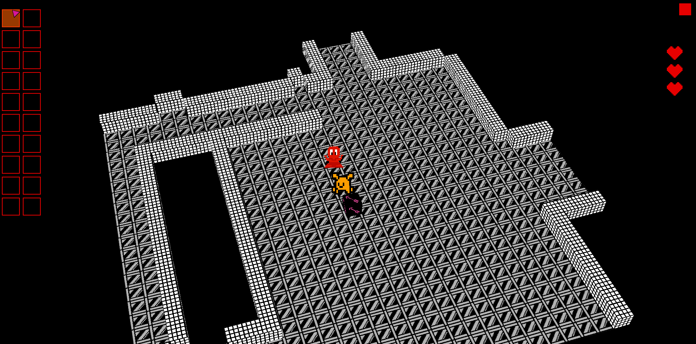

# 3D_RPG_March2022
Idea for a 3D 1 Bit RPG layout using a mix of 2D sprites and 3D level.

Will probably only work on a 1920X1080 resolution though I may be wrong (or it will work though look a bit strange)

Input via mouse / TAB key for map

F1/F2/F3 for developer menus

END close window

Watch on Youtube https://www.youtube.com/watch?v=2681smk1co4

 

  
